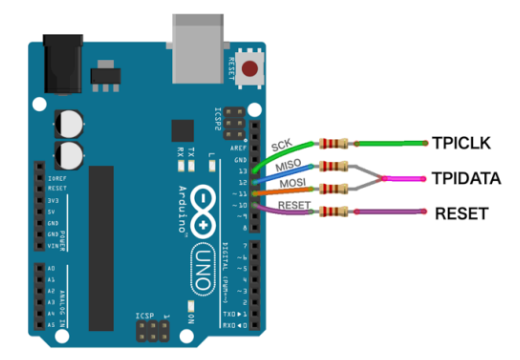

# Spark Design Club F!rosh Kit 2T5
F!rosh kit PCB design and programming files for F!rosh 2T5.


# Description
The Spark F!rosh Kit 2T5 is a set of custom PCB designs featuring the Spark Design Club logo and branding. It is designed to act as a puzzle piece with two different color options. Each board of one colour can piece with two other boards of the other colour on two edges, and with 4 boards together, they form a loop in the shape of a large square!

This PCB features the ATTiny10 microcontroller, a small and versatile chip that can be easily powered, perfect for small, low-power applications like this F!rosh Kit PCB. Each board can communicate with the "downstream" board it is connected to and share power, with the ability to identify if the board itself has the "source power". 

The boards alone is a durable design for a keychain, showcasing your interest in electronics and design. When soldered, it can be used as a simple LED light source when powered. 

The real complex design of the boards comes into play when 4 soldered boards come together and form the larger square shape. When powered, these boards can be used to display more complex patterns!

The objective of this design is to make a cool-looking PCB, while also using its puzzle-like design to encourage F!rosh this year to meet new friends (reference: some old coca-cola commercial that did this...)

# File Structure
- `board_design_files/`: Contains the PCB design files for the F!rosh 2T5 kit.
- `frosh_kit_program/`: Contains the Arduino program files for the F!rosh 2T5 kit.
- `imgs/`: Contains images related to the F!rosh 2T5 kit.
- `programming_resources/`: Contains resources for programming the ATTiny10 microcontroller. These files may be produced by other people. 

# Programming
The instruction to program the F!rosh kit was originally found on [this tutorial](https://make.kosakalab.com/make/electronic-work/arduio_tpi_en/). Unfortunately, as of September 1, 2025, this tutorial site is no longer available. Therefore, I have provided the necessary instructions below.

## Wire Connections
1. Prepare an Arduino UNO and 4 resistors (anywhere from 220Ω to 1kΩ should work).
2. Connect pin 10, 11, 12, and 13 of the Arduino UNO to the 4 resistors. Respectively, the other end of the resistors connected to pins 10, 11, 12, and 13 represents RESET, MOSI, MISO, and SCK. (Image from the original tutorial)

3. Connect RESET to the `R` pin, MOSI and MISO both to the `D` pin, and SCK to the `C` pin. The pins are visible from the front of the board:


## Programming Environment Setup
1. Download the [modified Arduino programmer](programming_resources/ATtiny4_5_9_10_20_40Programmer_2/) obtained from the original tutorial.
2. Using the Arduino IDE, upload this sketch to the Arduino UNO.
3. Copy the following package.json URL to the Arduino IDE's Additional Board Manager URLs: `https://raw.githubusercontent.com/AG2048/spark_frosh_kit_2t5/refs/heads/main/programming_resources/package_bitDuino10-arduinoTPI_index.json` and click `OK`. (The original json file link is [here](https://kimio-kosaka.github.io/bitDuino10-arduinoTPI/package_bitDuino10-arduinoTPI_index.json), but a bug fix was needed to make this work on newer versions of Arduino IDE / AVR Board Packages)
4. Go to Tools > Board > Boards Manager, search for `bitduino`, and install `bitDuino10-aTPI`.
5. In Tools > Board, select `ATtiny10(bitDuino10-arduinoTPI)` as the active board, and select the port that the Arduino UNO is connected to. 

## Programming the ATTiny10
1. Load the (F!rosh Kit Program)[frosh_kit_program/] into the Arduino IDE.
2. Click the "Upload" button. 

## Notes:
The original package had a bug with the avr-gcc compiler version. Originally, it has to be set to version `5.4.0-atmel3.6.1-arduino2`, which forces users to use Arduino IDE 1.8.9 or less and version 1.6.23 of the Arduino AVR Boards platform. Details of this bug can be found in this [issue thread](https://github.com/kimio-kosaka/bitDuino10-arduinoTPI/issues/4#issuecomment-1046231772). 

As a fix, I adopted the solution mentioned in the issue thread, and made my [own copy of the package json file](programming_resources/package_bitDuino10-arduinoTPI_index.json) that adds the following package dependency specifications:

```json
      "toolsDependencies": [
        {
          "packager": "arduino",
          "name": "avr-gcc",
          "version": "5.4.0-atmel3.6.1-arduino2"
        },
        {
          "packager": "bitDuino10-aTPI",
          "name": "avrboy",
          "version": "1.0.1"
        }
      ]
```